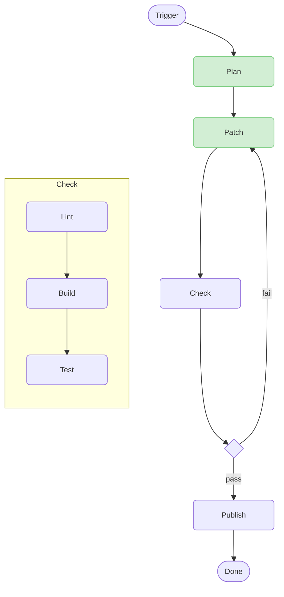

# Software Factory

## Hatchet

```
docker compose up -d
```

**Username:** `admin@example.com`

**Password:** `Admin123!!`


## Runner Worker

The runner worker registers Hatchet tasks to run CI-like jobs.

**Tasks:**
* [`container_runner`](./src/software_factory/tasks/container_runner.py) for `runner:container` events
* [`ssh_runner`](./src/software_factory/tasks/ssh_runner.py) for `runner:ssh` events

### Environment

```env
HATCHET_CLIENT_HOST_PORT=127.0.0.1:7077
HATCHET_CLIENT_TLS_STRATEGY=none
HATCHET_CLIENT_TOKEN=...
```

### Usage

```
uv run runner-worker
```

### Triggering Runners

See the source code for the available fields in runner input objects.

```python
from software_factory.hatchet_provider import hatchet
from software_factory.tasks.container_runner import ContainerRunnerInput

if __name__ == "__main__":
    hatchet.event.push(
        "runner:container",
        ContainerRunnerInput(
            git_repo_url="git@github.com:mbr4477/software-factory.git",
            git_branch_name="main",
            image="alpine/git:latest",
            script=["git log --oneline --graph"],
            entrypoint=["sh"],
        ).model_dump(),
    )
```

## Build a Factory Line

Combine container and SSH runner jobs to build your software factory line.
Define the inputs and outputs of each black box in the assembly line.

- Do one thing in each task. If you have multiple targets, build them in separate tasks instead of a monolithic build task
- Just like a bug points to a unit test that wasn't written, unmergeable factory code points to a quality check that wasn't written


